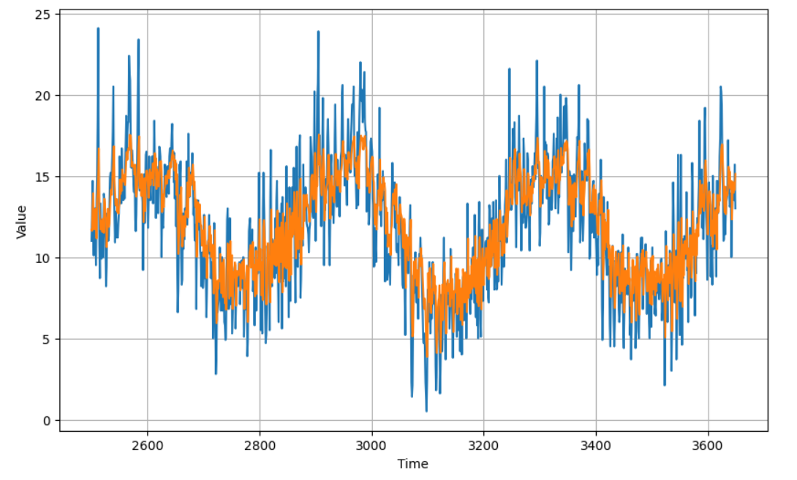

# Time Series Analysis – Melbourne Daily Minimum Temperature

## 📌 Overview  
This project investigates time series forecasting using Melbourne’s daily *minimum* temperature dataset. The goal is to model, predict, and understand temperature trends using deep learning methods — particularly LSTM (long short-term memory) and convolutional layers — to enhance prediction accuracy.

---

## 🛠️ Tools & Technologies  
- Python, Jupyter Notebook  
- TensorFlow / Keras (LSTM, Conv1D layers)  
- Pandas / NumPy for data manipulation  
- Matplotlib / Seaborn for visualizations  

---

## 📂 Dataset  
- Source: `daily-min-temperatures.csv` (public historical dataset)  
- Data covers daily minimum temperature values for Melbourne  
- Key fields: date, minimum temperature  

---

## 🔍 Methodology  
1. **Data Preparation & Exploration**  
   - Parsing dates, handling missing values (if any)  
   - Visualizing trends, seasonality, and autocorrelation  
2. **Feature Engineering**  
   - Creating lagged features to capture temporal dependencies  
   - Scaling / normalization  
3. **Modeling**  
   - Baseline models  
   - Deep learning models including LSTM and combinations with convolutional layers (Conv1D + LSTM)  
   - Tuning hyperparameters (e.g. number of layers, units, window sizes)  
4. **Evaluation**  
   - Metrics: Mean Squared Error (MSE), Mean Absolute Error (MAE)  
   - Visual comparison: predicted vs actual temperature  

---

## 📊 Results & Insights  
- **Forecast Performance:**  
  - MSE = **5.41**  
  - MAE = **1.81**  
- Observed strong seasonal patterns (warmer vs cooler months).  
- Lag features significantly improved prediction consistency.  
- Visualization revealed model struggles on extreme outlier days.  

---

## 📈 Example Visuals  

Predicted vs actual minimum temperature values:  



---

## 🚀 How to Run This Project  
1. Clone this repository:  
   ```bash
   git clone https://github.com/Josefxl/Time_Series_Analysis-Melbourne_Daily_Minimum_Temperature.git
